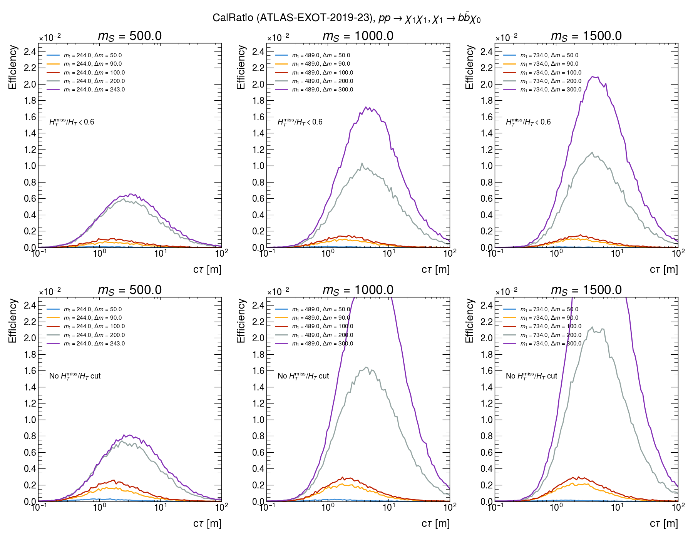

# CalRatio Recast ([ATLAS-EXOT-2019-23](https://atlas.web.cern.ch/Atlas/GROUPS/PHYSICS/PAPERS/EXOT-2019-23/))


The recast code and results are based on [arXiv:2412.13976](https://arxiv.org/pdf/2412.13976), the auxiliary material
provied in [HepDATA](https://www.hepdata.net/record/ins2043503) and the [code developed by Louie Corpe](https://github.com/llprecasting/recastingCodes/tree/main/DisplacedJets/ATLAS-EXOT-2019-23).


Validation of the results can be found in the [validation folder](./validation)


## Results for the DipoleDM Model:

The signal efficiencies for several parameters are shown below:

<p float="left">
    
</p>

The top plots include the cut $H_T^{miss}/H_T < 0.6$ (computed at parton level) assumed by the ATLAS analysis, while the bottom row
does not impose this requirement.

## Reproducing the results

There are two paths for reproducing the results above:

 1. Generate HepMC events with MadGraph5 plus Pythia8 and compute the efficiencies using the hepmc file or
 2. Run MadGraph5 plus DelphesPythia8, which stores the necessary information in a ROOT file. This can then be read for computing the efficiencies

Method 1. is based on the [original version of the recast code](https://github.com/llprecasting/recastingCodes/tree/main/DisplacedJets/ATLAS-EXOT-2019-23),
but it requires storing large HepMC files and is about 6x slower. Method 2. is faster and requires storing small ROOT files. 
However, it requires a [modified version of Delphes](https://github.com/llprecasting/recastingCodes/tree/main/Delphes_LLP), which stores LLPs and their
decays in the output.

### Method 1

For generating events run:

```
./runScanMG5_hepmc.py -p <parameters_file>
```

where one example of the parameters file can be found [here](./parameters_mg5Pythia8.ini).
Once the event generation is over, the efficiencies can be computed using the HepMC files generated running:

```
./getEffsFromHepMC.py -p <parameters_file> -f <path-to-events-folder>/Events/run*/*hepmc*gz
```
where one example of the parameters file can be found [here](./parameters_getEff.ini).
This file defines the PDGs for the LLP and what should be considered as invisible in the LLP decays.
It also provides a list of $c\tau$ values for which the efficiencies will be computed and other options.


### Method 2

For generating events run:

```
./runScanMG5_root.py -p <parameters_file>
```

where one example of the parameters file can be found [here](./parameters_mg5Delphes.ini).
Once the event generation is over, the efficiencies can be computed using the ROOT files generated running:

```
./getEffsFromROOT.py -p <parameters_file> -f <path-to-events-folder>/Events/run*/*root
```
where one example of the parameters file can be found [here](./parameters_getEff.ini).
This file defines the PDGs for the LLP and what should be considered as invisible in the LLP decays.
It also provides a list of $c\tau$ values for which the efficiencies will be computed and other options.
The output will consist of a csv file for each ROOT file containing the efficiencies for
the provided $c\tau$ values. The files will be stored in the same folder as the ROOT file.

## Plotting the results

Validation plots similar to the ones in [arXiv:2412.13976](https://arxiv.org/pdf/2412.13976) can be generated running:

```
./plotEfficiencies.py -f INPUTFILE -M MPHI -m MS -e EFFPLOT -x XSECPLOT
```

where INPUTFILE is the one of the csv files containing the signal efficiencies, (MPHI,MS) are
the corresponding ( $m_{\Phi}$ , $m_{S}$ ) mass values assumed by ATLAS (for comparing against the official ATLAS curves) and EFFPLOT and XSECPLOT are the names of the efficiency plot and cross-section upper limit plot, respectively.

Finally, a [notebook](./plotCurves.ipynb) is provided for comparing several curves and obtained the figure above.
