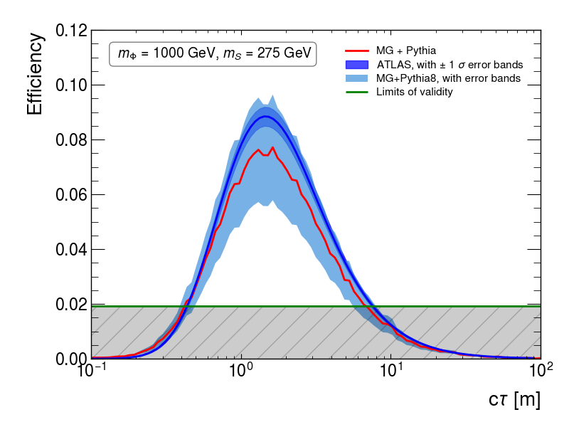
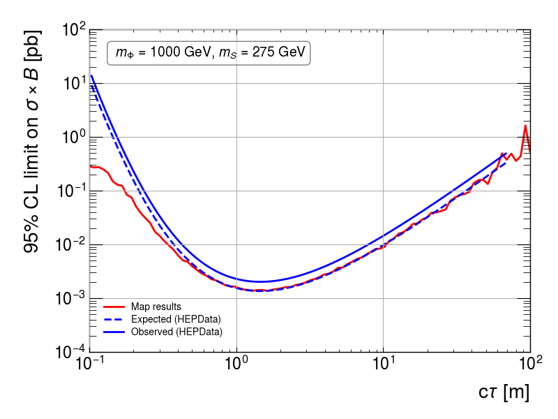
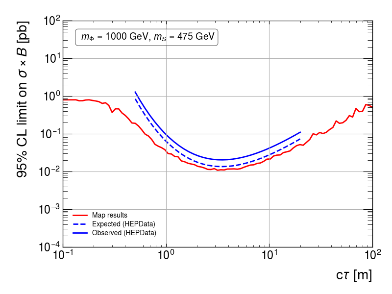

# Validation of CalRatio Recast ([ATLAS-EXOT-2019-23](https://atlas.web.cern.ch/Atlas/GROUPS/PHYSICS/PAPERS/EXOT-2019-23/))

The recast code and results are based on [arXiv:2412.13976](https://arxiv.org/pdf/2412.13976), the auxiliary material
provied in [HepDATA](https://www.hepdata.net/record/ins2043503) and the [code developed by Louie Corpe](https://github.com/llprecasting/recastingCodes/tree/main/DisplacedJets/ATLAS-EXOT-2019-23).

All the parameters for the event generation are defined in [parameters_mg5Delphes_HAHM.ini](./parameters_mg5Delphes_HAHM.ini).

The results below were obtaining using the Method 2 described [here](../README.md) and the [plotEfficiencies](../plotEfficiencies.py) code.

 * $m_{\Phi} = 1$ TeV and $m_S = 275$ GeV:

 

     
     
 

 

 * $m_{\Phi} = 1$ TeV and $m_S = 475$ GeV:

 

     
     
 

 