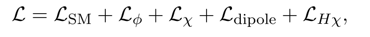
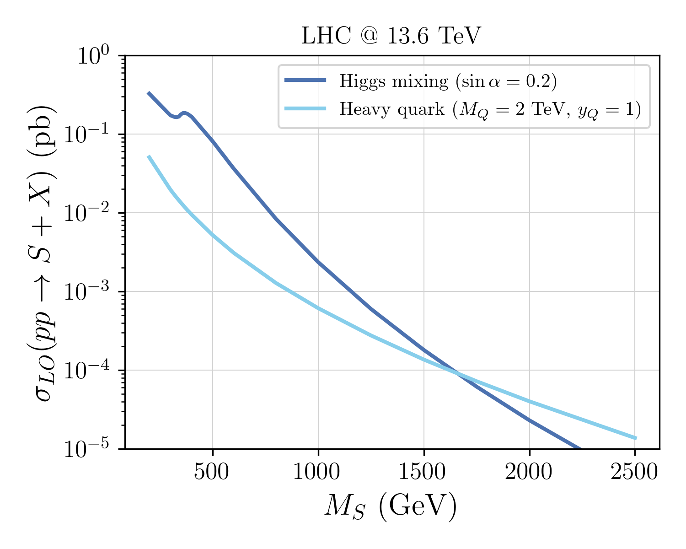

# back2futureTrigger

## Dipole DM Model (J. Zurita)

The BSM Lagrangian implemented [here](./models/DipoleDM/DipoleDM.fr) is based on this expression (see [this note](./model_building_BTTF.pdf) for more details)

    

### Cross-sections

The cross-section for $p p \to S$ production is computed considering two scenarios:

 1. *Higgs Mixing*: in this case the $g g \to S$ process is generated through a top quark loop and is suppressed by the $S-h$ mixing ($\sin \alpha$).
 2. *Heavy BSM Quark*: in this case $ g g \to S$ process is generated through a vector-like BSM quark loop and is suppressed by the heavy quark mass ($M_Q$).

 The *leading order* cross-sections (no k-factors applied) for the two scenarios above are shown below as a function of the $S$ mass ($M_S$):

 

    

## Some References

[https://arxiv.org/pdf/1511.05584](https://arxiv.org/pdf/1511.05584)

[Soft gluon radiation in Higgs boson production at the LHC](https://cds.cern.ch/record/314471/files/9611272.pdf)

[https://cds.cern.ch/record/280777/files/9504378.pdf](https://cds.cern.ch/record/280777/files/9504378.pdf)
