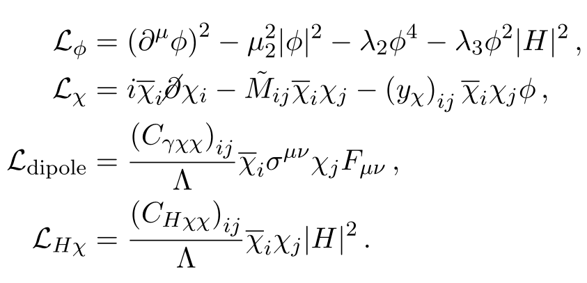
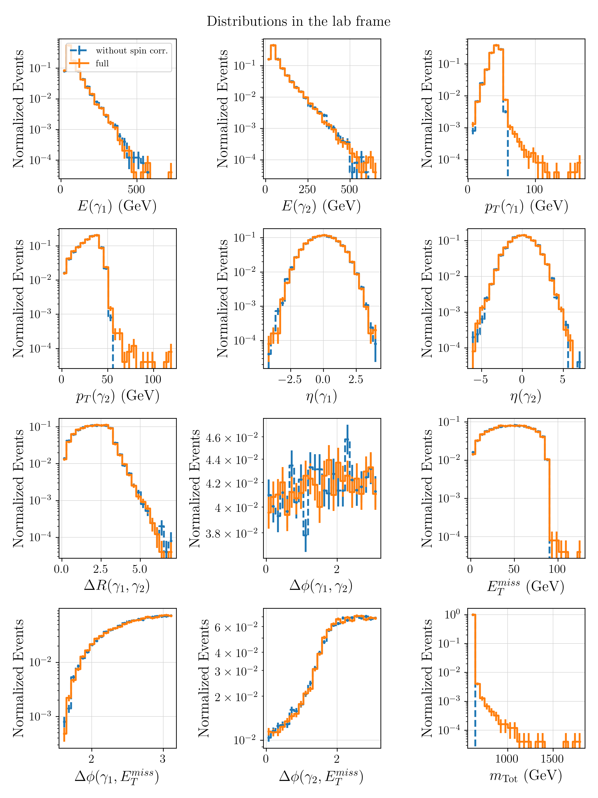

# back2futureTrigger

## Dipole DM Model (A. Lessa and J. Zurita)

The BSM Lagrangian implemented [here](./models/DipoleDM/DipoleDM_full.fr) is based on [this note](./models/DipoleDM/dipoleDM.pdf):

    

where the terms are:

    

### Minimal scenario

A minimal version of the above Lagrangian can be obtained with the [MinimalDipoleDM restrictions](./models/DipoleDM/MinimalDipoleDM.rst), which imposes the additional requirements:

$$
(y_{\chi})_{00} = (y_{\chi})_{10} = (y_{\chi})_{01} = 0
$$
$$
(C_{\gamma\chi\chi})_{00} = (C_{\gamma\chi\chi})_{11} = 0
$$
$$
(C_{H\chi\chi})_{00} = (C_{H\chi\chi})_{11} = 0
$$
With the above conditions $\chi_1$ only decays through the effective operators and there is no $\chi_0\chi_0$ or $\chi_1\chi_0$ production at tree level.

### Cross-sections

The cross-section for $p p \to S$ production is computed considering  the  *Higgs Mixing* scenario, where the $g g \to S$ process is generated through a top quark loop and is suppressed by the $S-h$ mixing ($\sin \alpha$).

 The *leading order* cross-sections (no k-factors applied) for the two scenarios above are shown below as a function of the $S$ mass ($M_S$):

 

    

### Spin Dependence

Although the $\chi_1 \to \chi_0 \gamma$ decay takes place through the dipole coupling ($\bar\chi_1 \sigma^{\mu\nu} \chi_{0} F_{\mu\nu}$ ),
this coupling does not produce any angular dependence. An explicit calculation of the differential decay rate can be found in [this notebook](./chi1Decay_FeynCalc.nb).

In order to investigate the spin dependence it is relevant to check the distributions for the processes:

 * $p p \to \chi_0 + \gamma + \chi_0 +  \gamma$ (full matrix element)
 * $p p \to S$. This process can then be decayed using MadSpin ($S \to \chi_1 \bar\chi_1$. This  $\chi_1 \to \chi_0 \gamma$) and assuming:
   * off-shell effects and spin correlations (``spinmode = madspin``)[^1]
   * without off-shell effects and without spin correlations (``spinmode = none``)

The constant decay rate ensures that spin correlations are not important for the decays considered.
However, off-shell effects have a (very) small impact on the distributions of the final state particles ($\chi_0$ and $\gamma$).
The comparison of several distributions are shown below and were produced using [this notebook](./spin_dists.ipynb):

    

[This notebook](./spin_tests.ipynb) shows the impact on the angular distributions of the daughters in the rest frame of the decaying particle 
with and without off-shell effects. In particular, it is shown that if off-shell effects are turned off, the results with the full matrix element are
identical to the ones without any spin correlation taken into account.

## Some References

[https://arxiv.org/pdf/1511.05584](https://arxiv.org/pdf/1511.05584)

[Soft gluon radiation in Higgs boson production at the LHC](https://cds.cern.ch/record/314471/files/9611272.pdf)

[https://cds.cern.ch/record/280777/files/9504378.pdf](https://cds.cern.ch/record/280777/files/9504378.pdf)

[^1]: We have verified that in this case the off-shell effects are only included for the primary mother, i.e. for $S$. The $\chi_1$ are still kept on-shell. Furthermore the smearing of $m_S$ is not as broad as in the full matrix element.
