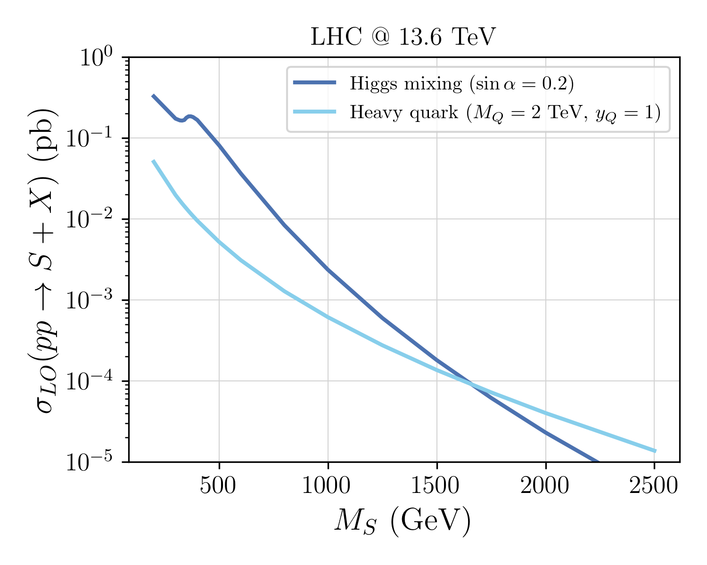

# back2futureTrigger

## Inelastic EFT DM Model (A. Lessa and J. Zurita)

The model extends the SM by adding three Dirac Fermions ($\chi_2$, $\chi_1$ and $\chi_0$) and a real scalar ($\phi$), all singlets under the SM gauge group.
The BSM Lagrangian implemented [here](./models/InelasticEFTDM/InelasticEFTDM_full.fr) is based on [this note](./notes/InelasticEFTDM.pdf):

$$
\mathcal{L} = \mathcal{L}_{\text{SM}} + \mathcal{L}_\phi + \mathcal{L}_\chi + \mathcal{L}_{H\chi}, 
$$

where  $`\mathcal{L}_{\text{SM}}`$ represents the SM Lagrangian and
$$
\begin{align}
   \mathcal{L}_{\phi} &=  \left(\partial^{\mu}\phi\right)^2 - \mu_2^2 |\phi|^2 - \lambda_2 \phi^4 - \lambda_3 \phi^2 |H|^2 \,, \\
   \mathcal{L}_\chi &=  i \overline{\chi}_i \cancel \partial \chi_i - \tilde{M}_{ij} \overline{\chi}_i \chi_j  - \left(y_\chi\right)_{ij} \overline{\chi}_i \chi_j \phi \,,\\
   \mathcal{L}_{H\chi} &= \frac{\left(C_{H \chi \chi}\right)_{ij}}{\Lambda} \overline{\chi}_i \chi_j |H|^2 \,.
\end{align}
$$
In the equations above $H$ represents the Higgs doublet.

Assuming that both $H$ and $\phi$ develop vevs, $\langle \phi \rangle = v_D/\sqrt{2}$ and $\langle H \rangle = v/\sqrt{2}$, we obtain the mass eigenstates $h$ and $S$:
$$
\begin{align}
	h &= (\sqrt{2} H^0 -v) \cos \alpha - (\sqrt{2} \phi-v_D) \sin \alpha \,,  \\
	S &= (\sqrt{2} \phi - v_D) \cos \alpha + (\sqrt{2} H^0 - v) \sin \alpha \,. 
\end{align}
$$
Where the mixing angle ($`\alpha`$) is given by
$$
\begin{equation}
	\tan(2 \alpha) \equiv \frac{\lambda_{3} v v_D}{\lambda_1 v^2-\lambda_2 v_D^2}\,.
\end{equation}
$$

### Minimal scenario

A minimal version of the above Lagrangian can be obtained with the [InelasticEFTDM_minimal restrictions](./models/InelasticEFTDM/InelasticEFTDM_minimal.rst), which imposes the additional requirements:

$$
(y_\chi)_{00}= (y_{\chi})_{10} = (y_{\chi})_{01} = (y_{\chi})_{22} = 0
$$
and 
$$
(C_{H\chi\chi})_{00} = (C_{H\chi\chi})_{11} = (C_{H\chi\chi})_{22} = (C_{H\chi\chi})_{20} = (C_{H\chi\chi})_{02} = (C_{H\chi\chi})_{21} = (C_{H\chi\chi})_{12} = 0
$$

With the above conditions $\chi_1$ only decays through the effective operator and the Lagrangian interactions simplify to:
$$
\begin{align}
   \mathcal{L}  &\supset  - \left[\left(y_\chi\right)_{21} \overline{\chi}_2 \chi_1 + \left(y_\chi\right)_{20} \overline{\chi}_2 \chi_0 + h.c.\right] \phi - \left(y_\chi\right)_{11} \overline{\chi}_1 \chi_1 \phi + \frac{\left(C_{H \chi \chi}\right)_{10}}{\Lambda} \left(\overline{\chi}_1 \chi_0 + h.c.\right) |H|^2 \,.
\end{align}
$$

### Cross-sections

The cross-section for $p p \to S$ production is computed considering  the  *Higgs Mixing* scenario, where the $g g \to S$ process is generated through a top quark loop and is suppressed by the $S-h$ mixing ($\sin \alpha$).

 The *leading order* cross-sections (no k-factors applied) for the two scenarios above are shown below as a function of the $S$ mass ($M_S$):

 

    

## Some References

[https://arxiv.org/pdf/1511.05584](https://arxiv.org/pdf/1511.05584)

[Soft gluon radiation in Higgs boson production at the LHC](https://cds.cern.ch/record/314471/files/9611272.pdf)

[https://cds.cern.ch/record/280777/files/9504378.pdf](https://cds.cern.ch/record/280777/files/9504378.pdf)

[^1]: We have verified that in this case the off-shell effects are only included for the primary mother, i.e. for $S$. The $\chi_1$ are still kept on-shell. Furthermore the smearing of $m_S$ is not as broad as in the full matrix element.
